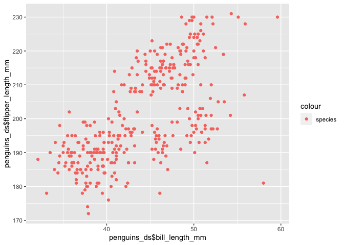

Assignment 1
================
Leo Liu
Sept 14 2020

This is my solution to Assignment 1

``` r
library(tidyverse)
```

    ## ── Attaching packages ───────────────────────────────────────── tidyverse 1.3.0 ──

    ## ✓ ggplot2 3.3.2     ✓ purrr   0.3.4
    ## ✓ tibble  3.0.3     ✓ dplyr   1.0.2
    ## ✓ tidyr   1.1.2     ✓ stringr 1.4.0
    ## ✓ readr   1.3.1     ✓ forcats 0.5.0

    ## ── Conflicts ──────────────────────────────────────────── tidyverse_conflicts() ──
    ## x dplyr::filter() masks stats::filter()
    ## x dplyr::lag()    masks stats::lag()

``` r
library(ggplot2)
```

### Problem 1

Create a data frame with the specified elements.

``` r
df = tibble(num = rnorm(10), 
            log_vec = num > 0 , 
            char_vec = c('a','b','c','b','c','c','a','b','a','c'), 
            fac_vec =      factor(c("F1","F2","F1","F1","F3","F2","F2","F1","F3","F3")))
```

Take the mean of each variable in the data frame df

``` r
mean(pull(df, num))
```

    ## [1] 0.3184469

``` r
mean(pull(df, log_vec))
```

    ## [1] 0.6

``` r
mean(pull(df, char_vec))
```

    ## Warning in mean.default(pull(df, char_vec)): argument is not numeric or logical:
    ## returning NA

    ## [1] NA

``` r
mean(pull(df, fac_vec))
```

    ## Warning in mean.default(pull(df, fac_vec)): argument is not numeric or logical:
    ## returning NA

    ## [1] NA

We cannot take the mean of character vectors and factor vectors.
Therefore, we should try to convert them into numerical values first
using as.numeric

``` r
as.numeric(pull(df, log_vec))
```

    ##  [1] 0 1 0 0 1 1 1 0 1 1

``` r
as.numeric(pull(df, char_vec))
```

    ## Warning: NAs introduced by coercion

    ##  [1] NA NA NA NA NA NA NA NA NA NA

``` r
as.numeric(pull(df, fac_vec))
```

    ##  [1] 1 2 1 1 3 2 2 1 3 3

``` r
as.numeric(pull(df, log_vec)) * pull(df, num)
```

    ##  [1] 0.0000000 1.4837782 0.0000000 0.0000000 0.8115961 1.0861113 0.4714009
    ##  [8] 0.0000000 0.1638900 0.7071687

``` r
factor(pull(df, log_vec)) * pull(df, num)
```

    ## Warning in Ops.factor(factor(pull(df, log_vec)), pull(df, num)): '*' not
    ## meaningful for factors

    ##  [1] NA NA NA NA NA NA NA NA NA NA

``` r
as.numeric(factor(pull(df, log_vec))) * pull(df, num)
```

    ##  [1] -0.6347186  2.9675564 -0.1137915 -0.1484161  1.6231923  2.1722226
    ##  [7]  0.9428019 -0.6425504  0.3277800  1.4143373

Problem 2

``` r
penguins_ds = palmerpenguins::penguins
```

The data set “penguins” consists of 8 columns and 344 rows. It contains
8 variables; they are species of penguin, islands they live in, bill
length in mm, bill depth in mm, flipper length in mm, body mass in
grams, sex, and year. The data set is mostly complete, with very few
missing values. The penguins’ mean flipper length is 200.92 mm.

We create a scatterplot of flipper\_length\_mm vs bill\_length\_mm

``` r
ggplot(penguins_ds, aes(x = penguins_ds$bill_length_mm, y = penguins_ds$flipper_length_mm, color = 'species')) + geom_point()
```

    ## Warning: Use of `penguins_ds$bill_length_mm` is discouraged. Use
    ## `bill_length_mm` instead.

    ## Warning: Use of `penguins_ds$flipper_length_mm` is discouraged. Use
    ## `flipper_length_mm` instead.

    ## Warning: Removed 2 rows containing missing values (geom_point).

<!-- -->
